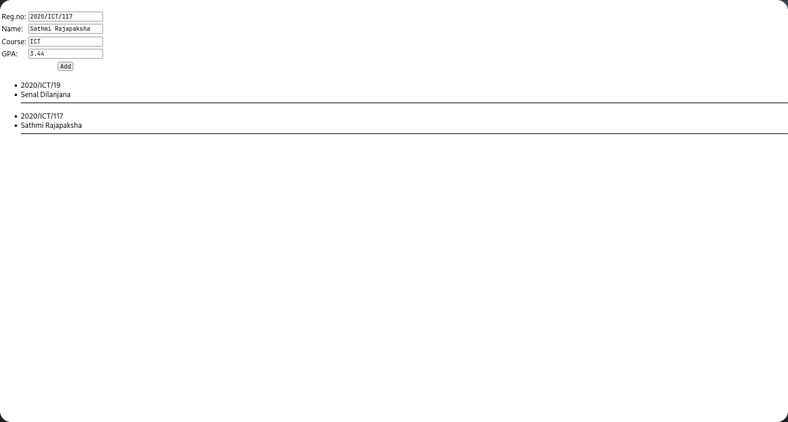

# Practical Date : 2024/11/05

This practical demonstrates **state management** and **form handling** using React's `useState` hook. It defines a `StudentInfo` component that:
1. Captures and stores user input using controlled components.
2. Manages a list of students dynamically.

Key Concepts:
- **React State**: 
  - `useState` is used to manage both the current `student` object and the `students` array.
  - The `setStudent` function updates individual fields of the `student` object.
- **Controlled Components**: Form fields (`<input>`) are controlled by the React state to ensure data flow is unidirectional.
- **Dynamic Rendering**: The list of `students` is rendered dynamically using the `map()` function.
- **Event Handling**: 
  - The `onChange` event updates the `student` state.
  - The `onClick` event adds the current `student` to the `students` array.

Techniques Used:
- **Immutability**: State updates use the spread operator (`...prevStu`) to ensure immutability.

Features:
- A form to input student details (Reg.no, Name, Course, GPA).
- A button to add the student details to a list.
- Display of the list of added students below the form.

Output:
