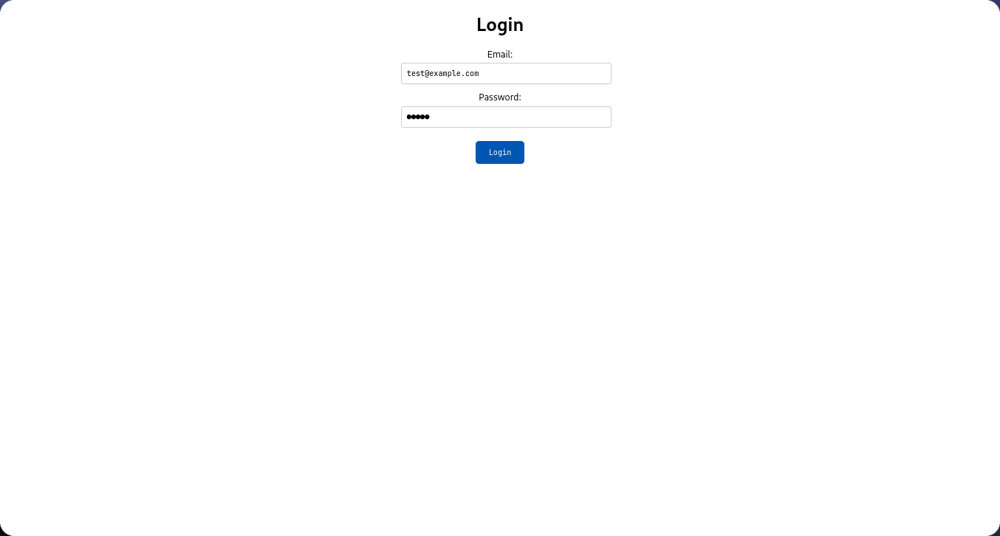
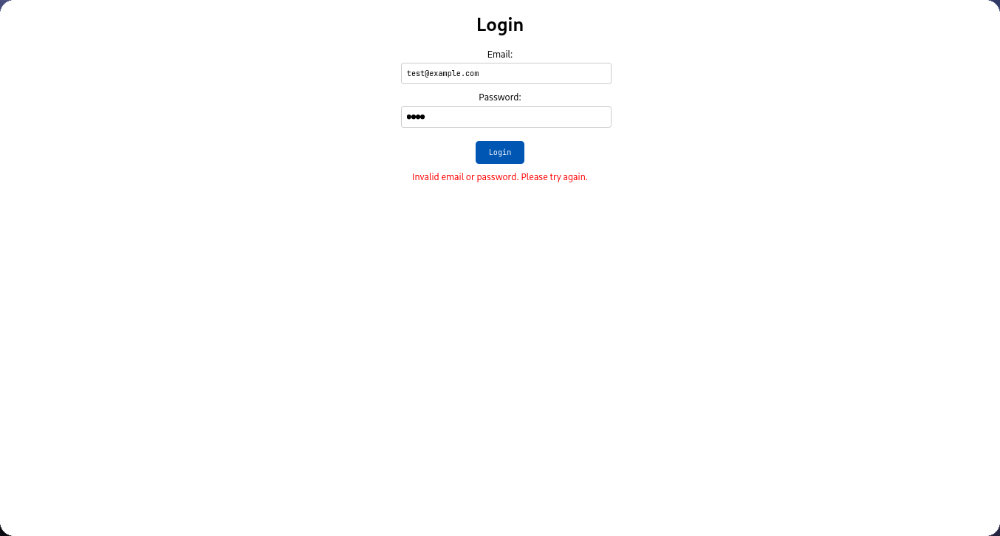
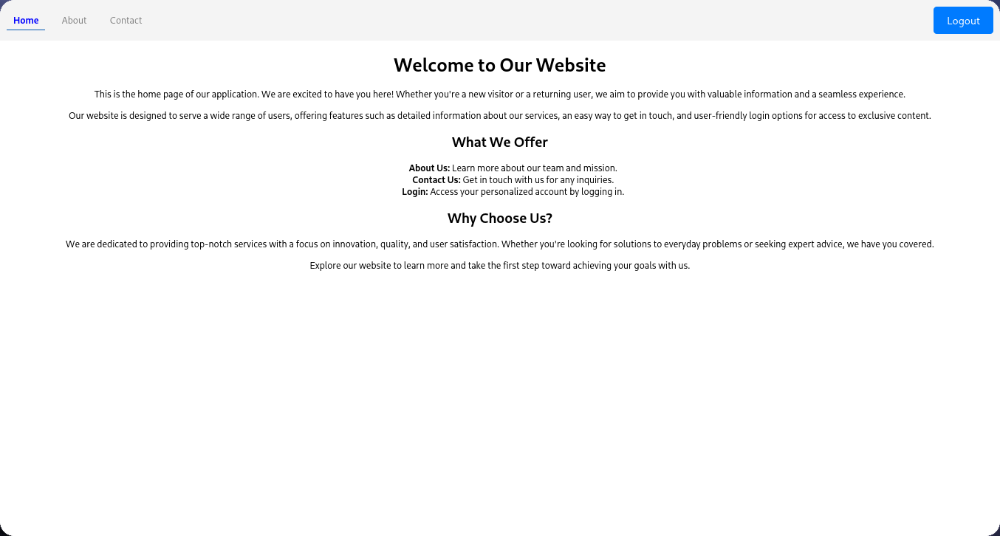
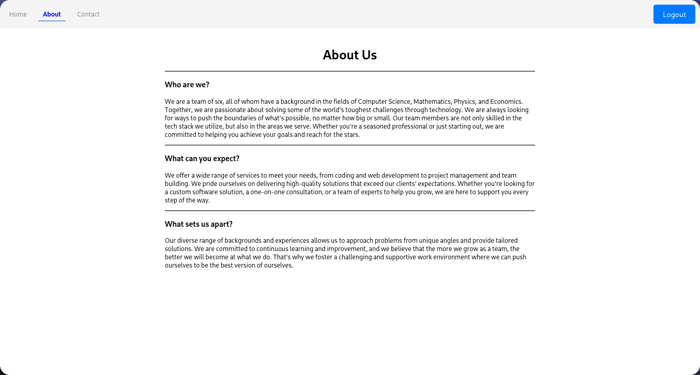
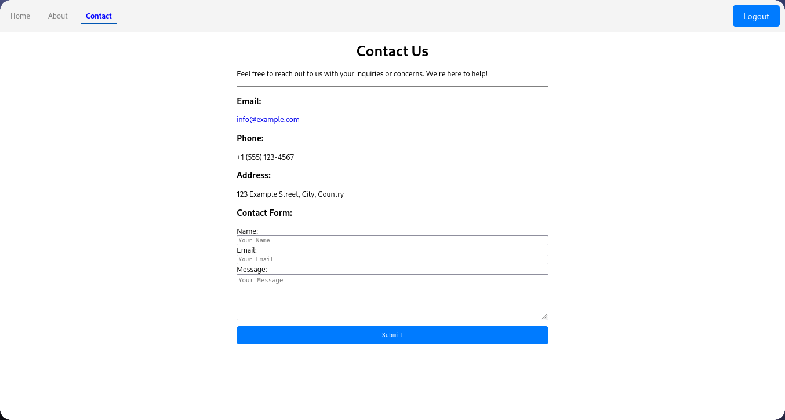

# Practical Date: 2024/11/26

This practical demonstrates the usage of **React Router** for navigation and **`useNavigate`** for programmatically navigating users within the app. Additionally, the app implements a simple login system using **`useState`** for managing user credentials and conditional rendering for hiding navigation links when logged in.

## Key Concepts:
1. **React Router (`react-router-dom`)**: 
   - This project uses React Router to manage navigation between pages. `react-router-dom` is a library that allows developers to declaratively define and handle routes in a React application.
   - **`Routes`**: Defines the different routes or paths in the app. Each `Route` corresponds to a specific component to be displayed when the user navigates to that path.
   - **`NavLink`**: A special type of anchor (`<a>`) tag that enables navigation within the app. It supports active styling to highlight the current route.
   
2. **Programmatic Navigation with `useNavigate`**: 
   - **`useNavigate`** is a React Router hook that allows navigation between routes without the user clicking a `NavLink` or `Link`. This is particularly useful when you need to navigate after performing some logic, such as a successful login.
   - After the user logs in successfully, **`useNavigate`** is used to redirect the user to the home page (`"/"`).
   
3. **State Management with `useState`**: 
   - The `useState` hook manages the state for credentials in the `Login` component. It is also used for managing error messages if the login fails.
   
4. **Conditional Rendering**: 
   - Based on the authentication status, the navigation links are hidden when the user is logged in. This is achieved by conditionally rendering the navigation bar.

## Features:
- **Navigation**: The app utilizes `react-router-dom` to handle navigation between multiple routes (`Home`, `About Us`, `Contact Us`, `Login`). The `NavLink` component is used to provide links between different pages.
- **Login System**: Users can log in using predefined credentials. Upon successful login, they are redirected to the home page using the `useNavigate` hook.
- **Conditional Rendering**: The app dynamically shows or hides navigation links based on whether the user is logged in or not.
- **User Feedback**: If the user inputs incorrect credentials, an error message is displayed.

## Features in `Login` Component:
- A form that allows the user to enter their email and password.
- The form checks the credentials against a predefined list of users.
- If the login is successful, the user is redirected to the home page using **`useNavigate`**.
- If the login fails, an error message is shown to the user.

## Techniques Used:
- **React Router (`react-router-dom`)**: 
   - **`<Router>`**: The top-level wrapper that enables routing in the app.
   - **`<Routes>` and `<Route>`**: Defines the routes for different pages.
   - **`NavLink`**: A navigation link that adds an active style based on the current route.
- **Programmatic Navigation with `useNavigate`**: 
   - **`useNavigate`** is used to navigate the user to the home page after a successful login. This is done without requiring any link click, allowing for dynamic redirection.
   - Example:
     ```javascript
     const navigate = useNavigate();
     navigate("/"); // Redirects to home page after successful login
     ```
- **State Management with `useState`**:
   - Used for managing form inputs (email, password) and error messages.
- **Conditional Rendering**: 
   - Hides the navigation links when the user is logged in and displays them otherwise.

## Output:

**Figure 1**


**Figure 2**


**Figure 3**


**Figure 4**


**Figure 5**

