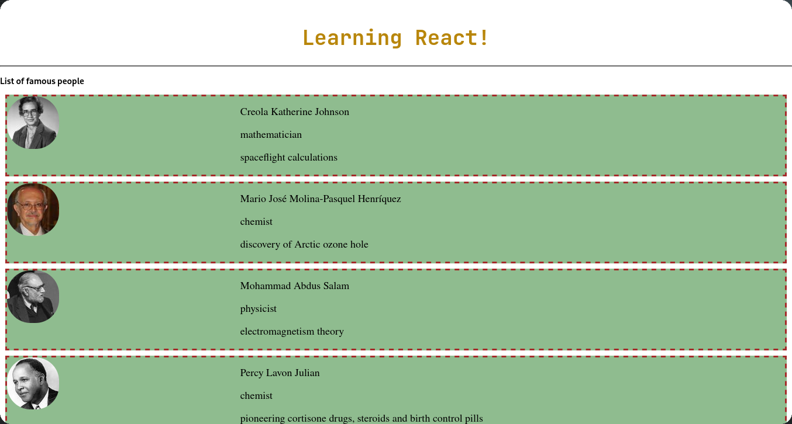

# Practical Date : 2024/10/08

This practical demonstrates the **component-based architecture**, **dynamic rendering**, **data-driven UI**, **props usage**, and **data mapping** using the `map()` function in React by composing a UI from modular components: `Header`, `Body`, and `Footer`.

Key Concepts:
1. **Component Composition**: The `App` component acts as a container for `Header`, `Body`, and `Footer`.
2. **Separation of Concerns**: Each UI segment is managed by a dedicated component, making the code more maintainable and reusable.
3. **Styling with CSS**: 
  - The `header` and `heading` classes are used to style the header section.
  - The `footer` class is used for styling the footer section.
  - The `maincard`, `profile`, and `details` classes are used for card-based design.
4. **JSX Markup**: It displays a title ("Learning React!") with a styled horizontal line.
5. **Props and Component Reuse**: Each `People` component receives individual person details (`detail`) as a prop.
6. **Data Mapping**: The `people` array is iterated using `map()` to render a list of famous people dynamically.
7. **Reusable Layout**: Provides a consistent footer design with a message about the purpose of the app.
8. **Props Destructuring**: The `detail` prop is destructured to access individual fields (e.g., `name`, `profession`, `accomplishment`, `imageId`).
9. **Dynamic Content**: Displays details for each person, including an image fetched dynamically based on `imageId`.

Features:
- Visual introduction to the app.
- Uses external CSS for styling.
- Displays a list of famous people using data from an external source (`people`).
- Dynamically generates `People` components for each entry in the `people` array.
- A horizontal line separates the footer from the rest of the content.
- Displays a message indicating the app's learning purpose and the year (UOV @ 2024).
- Creates a profile card for each famous person.
- Displays their image, name, profession, and accomplishments.

Overall Project Highlights

1. **Modular Design**: The app uses multiple functional components (`Header`, `Body`, `Footer`, and `People`) to divide responsibilities.
2. **Dynamic Rendering**: Utilizes the `map()` function to dynamically generate UI elements from an array (`people`).
3. **Styling with CSS**: External stylesheets are used to apply consistent and reusable designs across components.
4. **Data Flow**: Data (`detail`) is passed from parent (`Body`) to child (`People`) components using props.
5. **Learning-Oriented Application**: Designed as a practice project for learning React basics, including components, props, and dynamic rendering.

Output:

**Figure 1:**