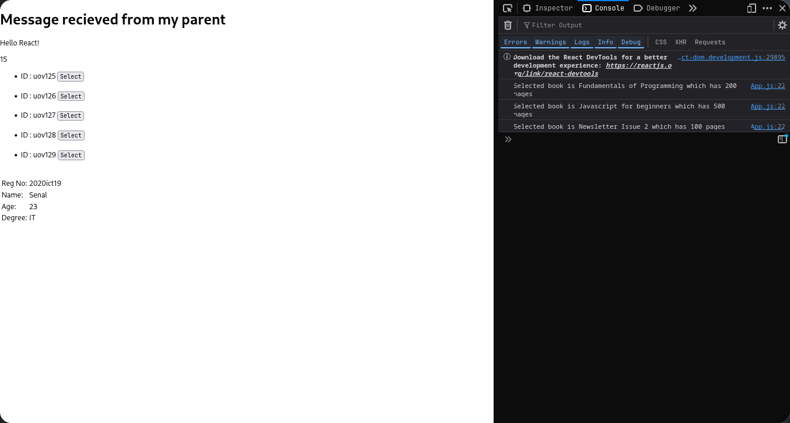

# Practical Date : 2024/10/15

This practical demonstrates a **React application layout** using `react-bootstrap` components and showcases **parent-to-child communication**, **props usage**, **function and data passing via props**, **data presentation using props**, **dynamic list rendering**, and **event handling via callbacks**.

Key Concepts:
1. **Bootstrap Integration**: Uses `Container`, `Row`, and `Col` from `react-bootstrap` for layout management.
2. **Props Passing**: Functions and data (`books` array) are passed to child components via props.
3. **Callback Functions**: The `selectedBook` function is passed to the `Books` component to handle user interactions.
4. **Function Execution**: Calls the `dosum` function with arguments and displays the result.
5. **Props**:
  - `bdata`: Array of book objects containing `id`, `name`, and `pages`.
  - `onSelectBook`: Callback function to handle book selection.
  - Receives student details (`regno`, `name`, `age`, `degree`) as props.
  - Receives a message (`msg`) and a function (`dosum`) from the parent.
6. **Dynamic Rendering**: Iterates over the `bdata` array using `map()` to render details of each book.
7. **Event Handling**: Invokes the `onSelectBook` function when a book is selected.

Features:
- **Custom Functions**:
  - `sum`: Demonstrates a simple calculation passed to the `Mycont` component for rendering results.
  - `selectedBook`: Logs details of the selected book, demonstrating callback usage.
- **Dynamic Rendering**: A list of books is rendered dynamically via the `Books` component.
- Includes components (`Mycont`, `Books`, `Student`) for different responsibilities.
- Displays:
  - A message received from the parent.
  - The result of the `sum` function passed by the parent.
- Simple and reusable component for displaying student data.

Overall Project Highlights:

1. **Bootstrap Layout**: The app uses `react-bootstrap` components for a responsive and structured layout.
2. **Props Usage**:
   - Data (`books`, student details, message) is passed to child components for rendering.
   - Functions (`dosum`, `onSelectBook`) are passed to demonstrate interactivity.
3. **Callback Functions**: Handles events (e.g., book selection) in the parent component using callbacks.
4. **Dynamic Rendering**: The `Books` component dynamically renders a list of books based on the provided array.
5. **Data Presentation**: The `Student` component is designed for straightforward and structured data display.

Output:

**Figure 1:**