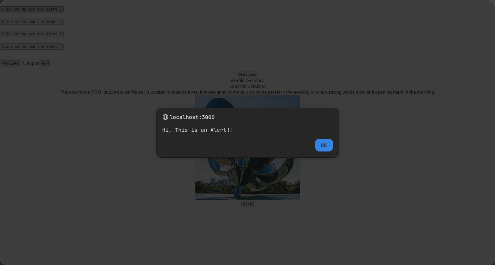
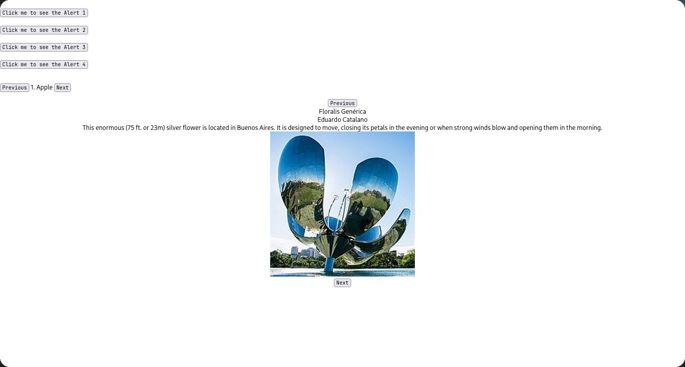
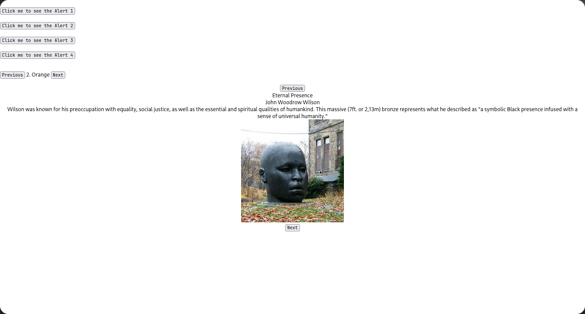

# Practical Date : 2024/10/22

This practical demonstrates **React state management**, **event handling**, and **dynamic content rendering**. The Artist component demonstrates **data navigation**, **stateful updates**, and **layout management** using `react-bootstrap`. The `index.js` file is the **entry point** of the React application.

Key Concepts:
1. **Props Usage**: Receives a `msg` prop for displaying custom alert messages.
2. **Event Handling**:
   - Multiple ways to define `onClick` event handlers, showcasing different styles (named functions, inline functions, arrow functions).
   - `showMsg`, `showMsg2`, and inline arrow function examples for alerts.
3. **State Management**:
   - Uses `useState` to track the current index of a `fruits` and `sculptureList` arrays.
   - `nextEle` and `prevEle` functions allow navigation through the array cyclically.
4. **Dynamic Rendering**:
   - Displays the current fruit dynamically based on the `index` state.
   - Displays information (`name`, `artist`, `description`) and an image for the current sculpture.
5. **Layout**:
   - Uses `Container`, `Row`, and `Col` from `react-bootstrap` to create a responsive design.
6. **ReactDOM Rendering**:
   - Uses `React.StrictMode` to wrap the app for highlighting potential issues.
   - Passes a custom `msg` prop to the `App` component.
7. **Bootstrap Integration**: 
   - Includes `bootstrap.min.css` for styling.

Features:
- Multiple alert buttons demonstrating different handler techniques.
- A simple navigable list of fruits with "Previous" and "Next" buttons.
- Includes the `Artist` component to display and navigate sculptures.
- Responsive layout with:
  - Navigation buttons in the left and right columns.
  - Sculpture details and image displayed in the center column.
- Cyclic navigation through sculptures.
- Demonstrates passing props (`msg`) to the root component.

Overall Project Highlights

1. **State Management**:
   - Uses `useState` for dynamic navigation in both `App` and `Artist` components.
   - Demonstrates managing and updating the current index for rendering different content.
2. **Event Handling**:
   - Showcases various techniques for handling click events.
   - Demonstrates event-driven navigation and alert displays.
3. **Dynamic Rendering**:
   - The `fruits` list and `sculptureList` are rendered dynamically based on the `index` state.
4. **Component Composition**:
   - Combines `App` and `Artist` components for modular and reusable functionality.
5. **Bootstrap Integration**:
   - Enhances layout and styling using `react-bootstrap`.

Output:

**Figure 1:**

**Figure 2:**

**Figure 3:**